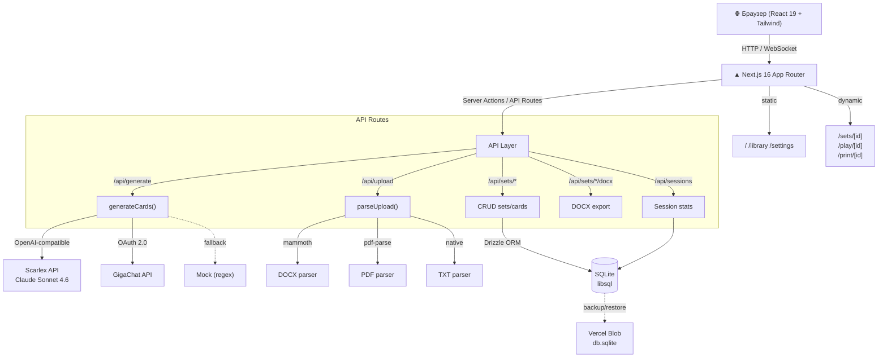
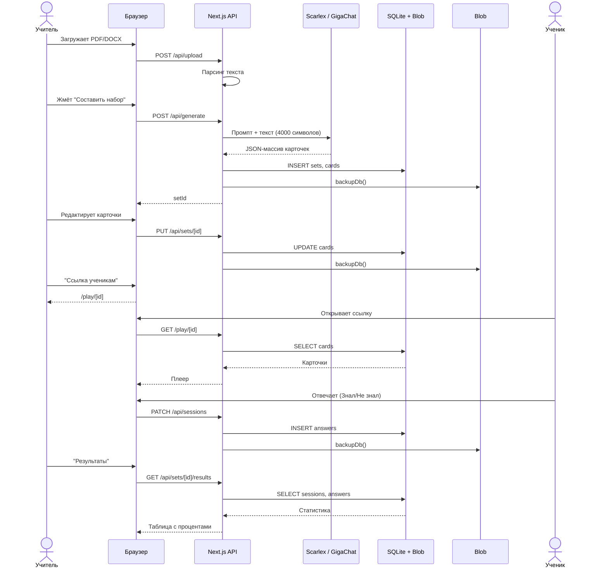
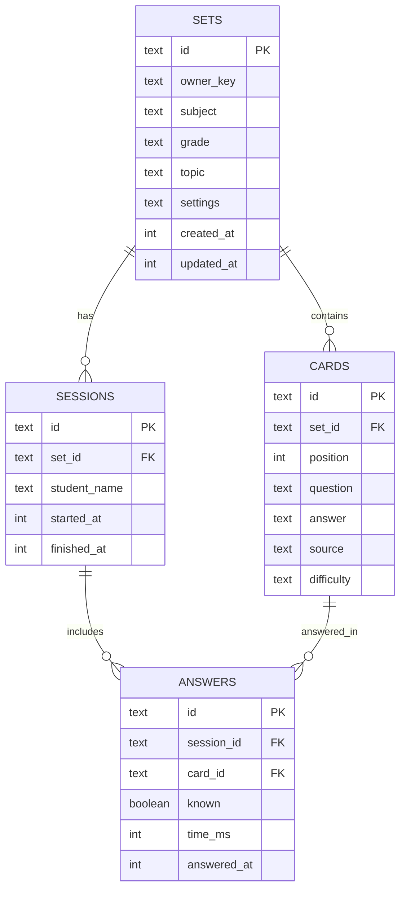

# Архитектура ГигаСамобранка

## Общая схема

## Диаграмма потоков данных

## Стек технологий

| Слой | Технология | Назначение |
|---|---|---|
| Frontend | Next.js 16.2.6, React 19, Tailwind v4 | SSR, компоненты, стили |
| ORM | Drizzle ORM | Type-safe SQL, миграции |
| БД | `@libsql/client` (SQLite) | Локально: файл; Prod: Vercel Blob |
| LLM | Scarlex (Claude), GigaChat, Mock | Генерация карточек |
| Парсинг | mammoth, pdf-parse, officeparser | DOCX, PDF, TXT, PPTX |
| Формулы | KaTeX | LaTeX в карточках |
| Экспорт | docx (npm) | DOCX вывод |
| Хостинг | Vercel | Serverless, SSL, CI/CD |

## Схема БД

## Безопасность и изоляция

- `owner_key` — случайная строка в HttpOnly cookie (`gs_owner`), без регистрации.
- Rate-limit: `LLM_REQUESTS_PER_HOUR=30` на пользователя.
- Данные учеников (sessions, answers) привязаны к `set_id` → `owner_key`.
- Нет публичного API для чтения чужих наборов.
